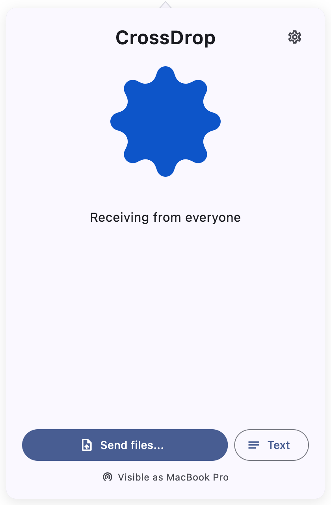
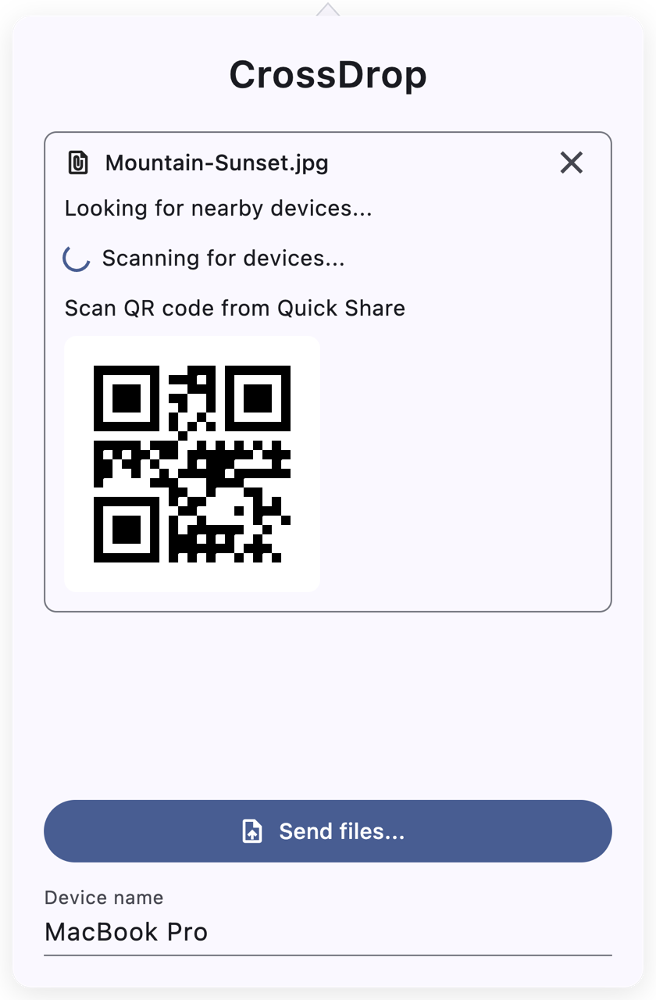

# CrossDrop

> [!IMPORTANT]
> This repository is back in an experimental continuation state on `main`. [Google has announced official compatibility between Quick Share and AirDrop](https://blog.google/products/android/quick-share-airdrop/), so this project may no longer be necessary for everyday use, but the codebase remains available.

**CrossDrop** is a partial implementation of [Google's Quick Share](https://blog.google/products/android/how-to-use-quick-share-android/) in Flutter for macOS, iOS and Linux. The app lives in your menu bar and saves files to your downloads folder.

CrossDrop is based on [NearDrop](https://github.com/grishka/NearDrop), a Swift implementation of Nearby Share for macOS. [Protocol documentation](https://github.com/grishka/NearDrop/blob/master/PROTOCOL.md) is available in the NearDrop repository.

## Screenshots

| Receiving | Sending |
| :---: | :---: |
|  |  |

## Installing

Grab the latest build from the [Releases](https://github.com/Medformatik/CrossDrop/releases) page.

> [!NOTE]
> I'm currently in the process of joining the Apple Developer Program so that CrossDrop can be released for macOS (signed and notarized), and possibly later for iOS/iPadOS as well.

### macOS

- **Homebrew** (once published to the tap):

  ```sh
  brew install --cask Medformatik/tap/crossdrop
  ```

- **Manual:** download `CrossDrop-<version>-macos-universal.zip`, unzip, and move `CrossDrop.app` to `/Applications`.

Published release builds are signed with a Developer ID and notarized by Apple, so Gatekeeper opens them without warnings. Locally built (unsigned) apps require a right-click → **Open**, or `xattr -dr com.apple.quarantine CrossDrop.app`.

### Linux

- **AppImage:** download `CrossDrop-<version>-linux-x86_64.AppImage`, then `chmod +x` it and run.
- **Tarball:** download `CrossDrop-<version>-linux-x64.tar.gz`, extract it, and run `./CrossDrop`.

### iOS

No public distribution yet — build and run from source (see below).

## Building from source

Requires the [Flutter SDK](https://docs.flutter.dev/get-started/install) **3.44.2 or newer**.

```sh
git clone https://github.com/Medformatik/CrossDrop.git
cd CrossDrop
flutter pub get
```

Run in development:

```sh
flutter run -d macos   # or: -d linux
```

Build release binaries:

```sh
flutter build macos --release    # → build/macos/Build/Products/Release/CrossDrop.app
flutter build linux --release    # → build/linux/x64/release/bundle/
flutter build ios --release      # requires an Apple Developer account for signing
```

On Linux, install the build toolchain first:

```sh
sudo apt-get install -y clang cmake ninja-build pkg-config libgtk-3-dev liblzma-dev
```

## Limitations

- **LAN only**. Your Android device and your Mac need to be on the same network for this app to work. Google's implementation supports multiple mediums, including Wi-Fi Direct, Wi-Fi hotspot, Bluetooth, some kind of 5G peer-to-peer connection, and even a WebRTC-based protocol that goes over the internet through Google servers. Wi-Fi direct isn't supported on macOS (Apple has their own, incompatible, AWDL thing, used in AirDrop). Bluetooth needs further reverse engineering.
- **Visible to everyone on your network at all times** while the app is running. Limited visibility requires talking to Google servers, and becoming temporarily visible requires listening for whatever triggers the "device nearby is sharing" notification.

## Contributing

Contributions are welcome! Please open an issue or a pull request.

CI (`.github/workflows/ci.yml`) formats, analyzes, and tests on every push and pull request, then compiles the macOS, Linux, and iOS apps. Pushing a `v*` tag triggers `.github/workflows/release.yml`, which builds a signed + notarized macOS app and packaged Linux artifacts (AppImage + tarball) and attaches them to a GitHub Release.

## FAQ

### Why does this exist next to NearDrop?

NearDrop is a Swift implementation of Nearby Share for macOS. It therefore only works on macOS. CrossDrop is a Flutter implementation of Nearby Share. It serves the same purpose, but works on more platforms. This way, Nearby Share can also be used on Linux and iOS.

### Why not the other way around, i.e. AirDrop on Android?

While I am an Android developer, and I have looked into this, this is nigh-impossible. AirDrop uses [AWDL](https://stackoverflow.com/questions/19587701/what-is-awdl-apple-wireless-direct-link-and-how-does-it-work), Apple's own proprietary take on peer-to-peer Wi-Fi. This works on top of 802.11 itself, the low-level Wi-Fi protocol, and thus can not be implemented without messing around with the Wi-Fi adapter drivers and raw packets and all that. It might be possible on Android, but it would at the very least require root and possibly a custom kernel. There is [an open-source implementation of AWDL and AirDrop for Linux](https://owlink.org/code/).
